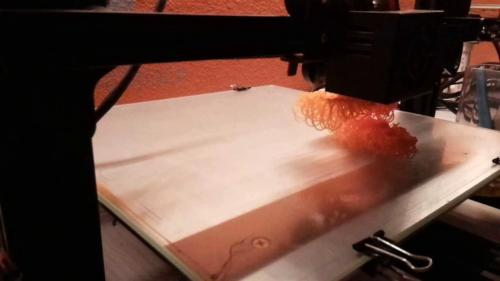
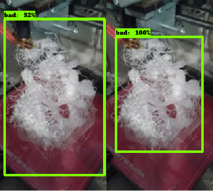

# How to make your own object detector 

> ### with TF (TensorFlow) Object Detection API & GCP (Google Gloud Platform)

EastFull: LEE DONGCHAN (huromech@gmail.com)


## TF Object Detection API and GCP


 

 Object detection is the task of recognizing what class an objects is and where it is located. So, this may be more complex and difficult to implement than a simple classification model. [TensorFlow Object Detection API](https://github.com/tensorflow/models/tree/master/research/object_detection) uses pre-trained object detection model to make it easier to implement object detection functions. In addition, the model can be trained in the cloud using [Google Cloud Platform](https://cloud.google.com/gcp/?utm_source=google&utm_medium=cpc&utm_campaign=na-US-all-en-dr-skws-all-all-trial-b-dr-1008076&utm_content=text-ad-none-any-DEV_c-CRE_109860918967-ADGP_Hybrid+%7C+AW+SEM+%7C+SKWS+%7C+US+%7C+en+%7C+Multi+~+Cloud-KWID_43700009609890930-kwd-19383198255&utm_term=KW_%2Bcloud-ST_%2Bcloud&gclid=CjwKCAiA4Y7yBRB8EiwADV1haezYvLCzbz2c6lJvwoLzlRAcCk7YaVJemA3VasM2MR4axqgmG02MqRoCS48QAvD_BwE) without configuring the hardware environment for learning. Therefore, this article will talk about how to make your own object detector using TensorFlow Object Detection API and Google Cloud Platform :D


## Tabel of Contents

0. Setting up the Google Cloud Platform
1. Installing TensorFlow and TensorFlow Object Detection API
2. Making dataset 
3. Using the pre-trained SSD for Transfer Learning
4. Training and Evaluation Jobs on Google Cloud ML Engine


## 0. Setting up the Google Cloud Platform

 Before we begin, we will do the following to use Google Cloud ML engine and Storage.

> 1. [Create a project](https://cloud.google.com/resource-manager/docs/creating-managing-projects)
> 2. [Modify a project's billing settings](https://cloud.google.com/billing/docs/how-to/modify-project)
> 3. [Install the Google Cloud SDK](https://cloud.google.com/sdk/install) to use Google Cloud Storage and ML Engine in your workplace (*In my case, I installed Ubuntu 18.04 LTS terminal in Windows 10. For the installaion of terminal, see [Terminal tutorial at fast.ai](https://course.fast.ai/terminal_tutorial.html) and the installation of Goolge Cloud CLI, see [here](https://course.fast.ai/start_gcp.html#step-2-install-google-cli) at course of fast.ai*)
> 4. [Enable the ML Engine APIs](https://console.cloud.google.com/flows/enableapi?apiid=ml.googleapis.com,compute_component&_ga=2.43515109.-1978295503.1509743045)
> 5. [Set up a Google Cloud Storage bucket](https://cloud.google.com/storage/docs/creating-buckets) (*Or, you can use the following command in the Google Cloud CLI*:`gsutil mb gs://YOUR_UNIQUE_BUCKET_NAME`)


 Next, you need to add a TPU-specific service account to give the cloud TPU access to the project. Enter the following command to get the name of the account:

```
curl -H "Authorization: Bearer $(gcloud auth print-access-token) \
	https://ml.googleapis.com/v1/projects/YOUR_PROJECT_ID:getConfig
```


After command,  copy the `tpuServiceAccount`(it looks like `service-account-12345@cloud-tpu.iam.gserviceaccount.com`) and save then as environment variable:

```
export TPU_ACCOUNT=your-service-account
```


And, give the role of ML serviceAgent to the TPU service account:

```
gcloud projects add-iam-policy-binding YOUR_PROJECT_ID  \
	--member serviceAccount:$TPU_ACCOUNT --role roles/ml.serviceAgent
```


## 1. Installing TensorFlow and TensorFlow Object Detection API

 You can install the TensorFlow Object Detection API by following [this installaion](https://github.com/tensorflow/models/blob/master/research/object_detection/g3doc/installation.md). Please refer to [here](https://www.tensorflow.org/install/) for more detailed procedures on TensorFlow. (*Notes: In my case, the version under tensorflow 1.13 and tensorflow 2.x did not work properly. I used the tensorflow 1.14.0 in a number of attempts :D - as of Feb, 2020*)


## 2. Making dataset

### 2.1. gathering data



 There is still one more important process left! We need data before we build our detection model. In my case, I have collected several data to find a badprint that frequently occurs in 3D printing. Collect data for your object detector :D


 ### 2.2. labeling data


 Now, we label the data that we have collected. I used [VoTT (Visual Object Tagging Tool)](https://github.com/microsoft/VoTT) to carry out labelling and saved it in the form of a `.csv` file.

In fact, it doesn't matter which labelling tool you use. However, if yo want to follow this article to configure the dataset, the information (about  `filename`, `xmin`, `ymin`, `xmax`, `ymax`, `class`) must be specified in the `.csv` file.


### 2.3. generating TFRecords

  In order to train the object detector, we have to create [TFRecords](https://www.tensorflow.org/tutorials/load_data/tfrecord). To do this, we will use `generate_tfrecord.py` from [datitran's raccon_dataset](https://github.com/datitran/raccoon_dataset). Before make TFRecords we need to change a few lines in the  `generate_tfrecord.py`.

From:

```python
# TO-DO replace this with label map
def class_text_to_int(row_label):
    if row_label == 'raccoon':
        return 1
    else:
        None
```


To:

```python
# TO-DO replace this with label map
def class_text_to_int(row_label):
    if row_label == 'bad':
        return 1
    elif row_label == 'WHAT YOU WANT !':
        return 2
    #.
    #.
    #.
    else:
        None
```

If you are using a different dataset, you must replace the class name. 


Now our TFRecords can be generated by:

```
python generate_tfrecord.py \
	--csv_input=YOUR_PATH/TRAIN_CSV_NAME.csv \
	--output_path=YOUR_PATH/train.record \
	--image_dir=YOUR_PATH/IMAGE_DIR
	
python generate_tfrecord.py \
	--csv_input=YOUR_PATH/VALID_CSV_NAME.csv \
	--output_path=YOUR_PATH/val.record \
	--image_dir=YOUR_PATH/IMAGE_DIR
```


Next, we will place the `.tfrecord` on our Google Cloud Storage bucket.

```
gsutil -m cp -r YOUR_PATH/train.record gs://YOUR_UNIQUE_BUCKET_NAME/data/
gsutil -m cp -r YOUR_PATH/val.record gs://YOUR_UNIQUE_BUCKET_NAME/data/
```


### 2.4. creating a label map

 The label map maps an id to a name. This file is in `.pbtxt` format. In my case, I made it using the vim editor in terminal.

```
item {
	id: 1
	name: 'bad'
}

item {
	id: 2
	name: 'WHAT YOU WANT !'
}

	.
	.
	.
```


After creating a label map, we will place the `.pbtxt` on our Google Cloud Storage bucket.

```
gsutil -m cp -r YOUR_PATH/LABEL_MAP.pbtxt gs://YOUR_UNIQUE_BUCKET_NAME/data/
```


## 3. Using the pre-trained SSD for Transfer Learning

### 3.1. downloading model

 There are many pre-trained models we can use. We will use the checkpoints from these pre-trained models and apply to our task. What makes this possible is Transfer Learning. This is a strategy that enables pretty good performance with less time and data. Anyway, please check out the [Object Detection Models Zoo](https://github.com/tensorflow/models/blob/master/research/object_detection/g3doc/detection_model_zoo.md).

```
wget http://storage.googleapis.com/download.tensorflow.org/models/object_detection/ssd_mobilenet_v1_fpn_shared_box_predictor_640x640_coco14_sync_2018_07_03.tar.gz

tar xzf ssd_mobilenet_v1_fpn_shared_box_predictor_640x640_coco14_sync_2018_07_03.tar.gz
```

So here we're going to use the ssd model based on the mobilenet. If you want a different model, try it! After downloading the model, upload the checkpoints of the model to Google Cloud Storage:

```
gsutil cp ssd_mobilenet_v1_fpn_shared_box_predictor_640x640_coco14_sync_2018_07_03/model.ckpt.* gs://YOUR_UNIQUE_BUCKET_NAME/data/
```


### 3.2. configuring the object detection pipeline

 In the TensorFlow Object Detection API, the model parameters, training and eval parameters are defined by a `.config` file. More details in [here](https://github.com/tensorflow/models/blob/master/research/object_detection/g3doc/configuring_jobs.md). Anyway, we'll need to configure some paths in order for the template to work. It will be  `PATH_TO_BE_CONFIGURED` in the code. Copy and move the config file corresponding to the model received for modification.

```
cp YOUR_PATH/models/research/object_detection/samples/configs/ssd_resnet50_v1_fpn_shared_box_predictor_640x640_coco14_sync.config .
```


First, modify the `PATH_TO_BE_CONFIGURED` of the copied file to our Google Cloud Storage bucket.

```
sed -i "s|PATH_TO_BE_CONFIGURED|"gs://YOUR_UNIQUE_BUCKET_NAME"/data|g" ssd_resnet50_v1_fpn_shared_box_predictor_640x640_coco14_sync.config
```


In addition, modify the other things (`input_path`, `output_path`,`batch_size`, `num_steps`, `total_steps`, and so on).

From:

```
	.
	.
train_config: {
  fine_tune_checkpoint: "gs://YOUR_UNIQUE_BUCKET_NAME/data/model.ckpt"
  batch_size: 64 #
  sync_replicas: true
  startup_delay_steps: 0
  replicas_to_aggregate: 8
  num_steps: 25000 #
  data_augmentation_options {
    random_horizontal_flip {
    }
  }
  	.
  	.
train_input_reader: {
  tf_record_input_reader {
    input_path: "gs://YOUR_UNIQUE_BUCKET_NAME/data/mscoco_train.record-00000-of-00100" #
  }
  label_map_path: "gs://YOUR_UNIQUE_BUCKET_NAME/data/mscoco_label_map.pbtxt" #
}
	.
	.
```


To:

```
	.
	.
train_config: {
  fine_tune_checkpoint: "gs://YOUR_UNIQUE_BUCKET_NAME/data/model.ckpt"
  batch_size: 16 #
  sync_replicas: true
  startup_delay_steps: 0
  replicas_to_aggregate: 8
  num_steps: 2000 #
  data_augmentation_options {
    random_horizontal_flip {
    }
  }
  	.
  	.
train_input_reader: {
  tf_record_input_reader {
    input_path: "gs://YOUR_UNIQUE_BUCKET_NAME/data/train.record" #
  }
  label_map_path: "gs://YOUR_UNIQUE_BUCKET_NAME/data/LABEL_MAP..pbtxt" #
}
	.
	.
```

This is just an example. Therefore, you should modify the `.config` as you intended.


Just like any other files, upload the `.config` to your Google Cloud Storage bucket.

```
gsutil cp ssd_resnet50_v1_fpn_shared_box_predictor_640x640_coco14_sync.config gs://YOUR_UNIQUE_BUCKET_NAME/data/pipeline.config
```

We're ready now! Let's train.


## 4. Training and Evaluation Jobs on Google Cloud ML Engine

 Before we start our training job in Google Cloud ML Engine, we need to package  the API, pycocotools and TF slim. 

```
# From YOUR_PATH/models/research/
bash object_detection/dataset_tools/create_pycocotools_package.sh /tmp/pycocotools
python setup.py sdist
(cd slim && python setup.py sdist)
```


And start training! Run following gcloud command:

```
gcloud ml-engine jobs submit training `whoami`_object_detection_`date +%s` \
 --job-dir=gs://YOUR_UNIQUE_BUCKET_NAME/train \
 --packages dist/object_detection-0.1.tar.gz,slim/dist/slim-0.1.tar.gz,/tmp/pycocotools/pycocotools-2.0.tar.gz \
 --module-name object_detection.model_tpu_main \
 --runtime-version 1.14 \
 --scale-tier BASIC_TPU \
 --region us-central1 \
 -- \
 --model_dir=gs://YOUR_UNIQUE_BUCKET_NAME/train \
 --tpu_zone us-central1 \
 --pipeline_config_path=gs://YOUR_UNIQUE_BUCKET_NAME/data/pipeline.config
```


After we start our training , run following command:

```
gcloud ml-engine jobs submit training `whoami`_object_detection_eval_validation_`date +%s` \
 --job-dir=gs://YOUR_UNIQUE_BUCKET_NAME/train \
 --packages dist/object_detection-0.1.tar.gz,slim/dist/slim-0.1.tar.gz,/tmp/pycocotools/pycocotools-2.0.tar.gz \
 --module-name object_detection.model_main \
 --runtime-version 1.14 \
 --scale-tier BASIC_GPU \
 --region us-central1 \
 -- \
 --model_dir=gs://YOUR_UNIQUE_BUCKET_NAME/train \
 --pipeline_config_path=gs://YOUR_UNIQUE_BUCKET_NAME/data/pipeline.config \
 --checkpoint_dir=gs://YOUR_UNIQUE_BUCKET_NAME/train
```


That's all! You can use TensorBoard to see the accuracy of  your model.

```
# This command needs to be run once to allow your local machine to access your
# GCS bucket.
gcloud auth application-default login

tensorboard --logdir=gs://YOUR_UNIQUE_BUCKET_NAME/model_dir
```




